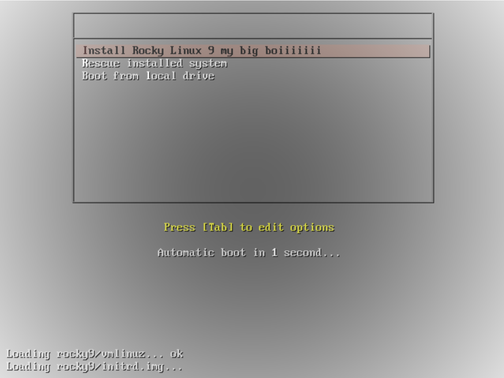

# TP2 : Network boot
## Sommaire

- [TP2 : Network boot](#tp2--network-boot)
  - [Sommaire](#sommaire)
- [I. Installation d'un serveur DHCP](#i-installation-dun-serveur-dhcp)
- [II. Installation d'un serveur TFTP](#ii-installation-dun-serveur-tftp)
- [III. Un peu de conf](#iii-un-peu-de-conf)
- [IV. Installation d'un serveur Apache](#iv-installation-dun-serveur-apache)
- [V. Test](#v-test)

# I. Installation d'un serveur DHCP

🌞 **Installer le paquet `dhcp-server`**
```bash
$ dnf install dhcp-server
```

#### 🌞 Conf du serveur dhcp :

```d
default-lease-time 600;
max-lease-time 7200;
authoritative;

option space pxelinux;
option pxelinux.magic code 208 = string;
option pxelinux.configfile code 209 = text;
option pxelinux.pathprefix code 210 = text;
option pxelinux.reboottime code 211 = unsigned integer 32;

subnet 10.1.1.0 netmask 255.255.255.0 {
    range 10.1.1.1 10.1.1.99; # Plage IP

    class "pxeclients" {
        match if substring (option vendor-class-identifier, 0, 9) = "PXEClient";
        next-server 10.1.1.11;
        if option architecture-type = 00:07 {
            filename "BOOTX64.EFI";
        }
        else {
            filename "pxelinux.0";
        }
    }
}

```

🌞 **Démarrer le serveur DHCP**

```bash
$ sudo systemctl start dhcpd
```

🌞 **Ouvrir le bon port firewall**

- avec `sudo firewall-cmd --add-service=dhcp --permanent` suivi de `sudo fireswall-cmd --reload`

```bash
$ sudo firewall-cmd --add-service=dhcp --permanent
success
$ sudo fireswall-cmd --reload
success
```

# II. Installation d'un serveur TFTP

Normalement c'est que pour du legacy, mais on le fait au cas où, suivant vos setups, i don't know.

C'est vitefé.

🌞 **Installer le paquet `tftp-server`**

```bash
$ sudo dnf install tftp-server
```

🌞 **Démarrer le socket TFTP**

- avec un `sudo systemctl enable --now tftp.socket`
```bash
$ sudo systemctl enable --now tftp.socket
Created symlink /etc/systemd/system/sockets.target.wants/tftp.socket → /usr/lib/systemd/system/tftp.socket.
```

🌞 **Ouvrir le bon port firewall**

- avec `sudo firewall-cmd --add-service=tftp --permanent` suivi de `sudo fireswall-cmd --reload`

```bash
$ sudo firewall-cmd --add-service=tftp --permanent
success
$ sudo fireswall-cmd --reload
success
```

> *C'est du port 69 en TCP ou UDP le protocole TFTP.*

# III. Un peu de conf

Dans cette section, on va récupérer certains fichier contenus dans l'ISO officiel de Rocky Linux, afin de permettre à d'autres machines de les récupérer afin de démarrer un boot sur le réseau.

Avec PXE c'est le délire : on fournit un ISO à travers le réseau, et les machines peuvent l'utiliser pour déclencher une install.

Let's go :

➜ Déjà, récupérez l'iso de Rocky Linux dans la VM.

```bash
$ scp Rocky-9.3-x86_64-minimal.iso vagrant@10.1.1.11:/home/vagrant/
```

➜ Ensuite, suivez le guide :

```bash
$ dnf -y install syslinux

$ cp /usr/share/syslinux/pxelinux.0 /var/lib/tftpboot/

$ mkdir -p /var/pxe/rocky9
$ mkdir /var/lib/tftpboot/rocky9

$ mount -t iso9660 -o loop,ro /home/vagrant/Rocky-9.3-x86_64-minimal.iso /var/pxe/rocky9

$ cp /var/pxe/rocky9/images/pxeboot/{vmlinuz,initrd.img} /var/lib/tftpboot/rocky9/
$ cp /usr/share/syslinux/{menu.c32,vesamenu.c32,ldlinux.c32,libcom32.c32,libutil.c32} /var/lib/tftpboot/

$ mkdir /var/lib/tftpboot/pxelinux.cfg
```

➜ Puis, déposez le contenu suivant dans le fichier `/var/lib/tftpboot/pxelinux.cfg/default` :

```conf
default vesamenu.c32
prompt 1
timeout 60

display boot.msg

label linux
  menu label ^Install Rocky Linux 9 my big boiiiiiii
  menu default
  kernel rocky9/vmlinuz
  append initrd=rocky9/initrd.img ip=dhcp inst.repo=http://10.1.1.11/rocky9
label rescue
  menu label ^Rescue installed system
  kernel rocky9/vmlinuz
  append initrd=rocky9/initrd.img rescue
label local
  menu label Boot from ^local drive
  localboot 0xffff
```

# IV. Installation d'un serveur Apache

🌞 **Installer le paquet `httpd`**
```bash
$ dnf install httpd
```

🌞 **Ajouter un fichier de conf dans `/etc/httpd/conf.d/pxeboot.conf`** avec le contenu suivant :

```apache
Alias /rocky9 /var/pxe/rocky9
<Directory /var/pxe/rocky9>
    Options Indexes FollowSymLinks
    # access permission
    Require ip 127.0.0.1 10.1.1.0/24
</Directory>
```

🌞 **Démarrer le serveur Apache**
```bash
$ sudo systemctl start httpd
```

🌞 **Ouvrir le bon port firewall**

- avec `sudo firewall-cmd --add-port=80/tcp --permanent` suivi de `sudo fireswall-cmd --reload`

```bash
$ sudo firewall-cmd --add-port=80/tcp --permanent
success
$ sudo firewall-cmd --reload
success
```

# V. Test

Pour tester, simple :

- vous ouvrez VirtualBox à la main
- vous créez une nouvelle VM
  - pas un clone
  - vous lui mettez pas d'ISO ni rien non plus
  - genre une machine avec un disque vierge
- il faut qu'elle ait une interface dans le même réseau host-only que votre serveur PXE pour pouvoir le contacter
- vous allumez la VM
- une install de Rocky est censée se lancer

🌞 **Analyser l'échange complet avec Wireshark**

- le mieux pour réaliser la capture est sûrement d'utiliser `tcpdump` depuis le serveur PXE

